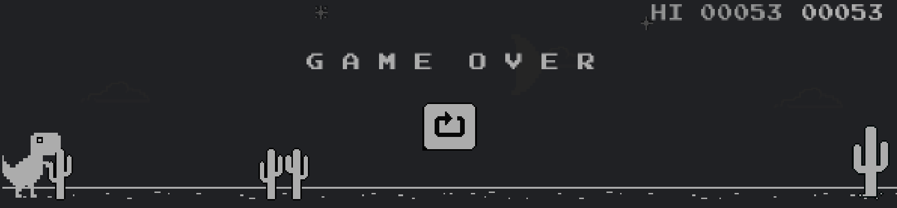

# ChromeDino
Reinforcement Learning AI plays ```chrome://dino``` game

# Demo


# Game:

Download Chrome<br>
Goto: [chrome Dino game](chrome://dino)

You can try [Chrome-Dino HTML Game](environment\Chrome-Dino.html)



# Setup
```pip install -r requirements.txt```

# Important 
Remember to open the the game screen in your primary monitor. <br>Because the game was not in gym environment, so I use OCR to get information from the game environment.<br>If you want to custom the environment (screenshot location, OCR engine, ...), checkout [environment.py](./environment.py)

# Train model
```python train.py```<br>If you want to custom the trainning, checkout [train.py](./train.py)

# Test model
Feel free to  run with default configs:
```python test.py```

Or with custom configs:
```python test.py --model MODEL_PATH --runtimes --NUMBER_OF_RUN```