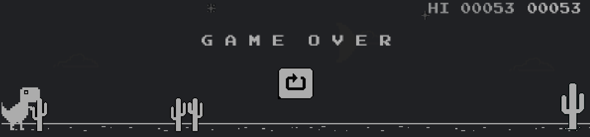

# ChromeDino
Reinforcement Learning AI plays ```chrome://dino game```

Download Chrome<br>

Goto: [game](chrome://dino)



# Setup
```pip install -r requirements.txt```

# Train model
```python train.py```

# Test model
```python test.py```